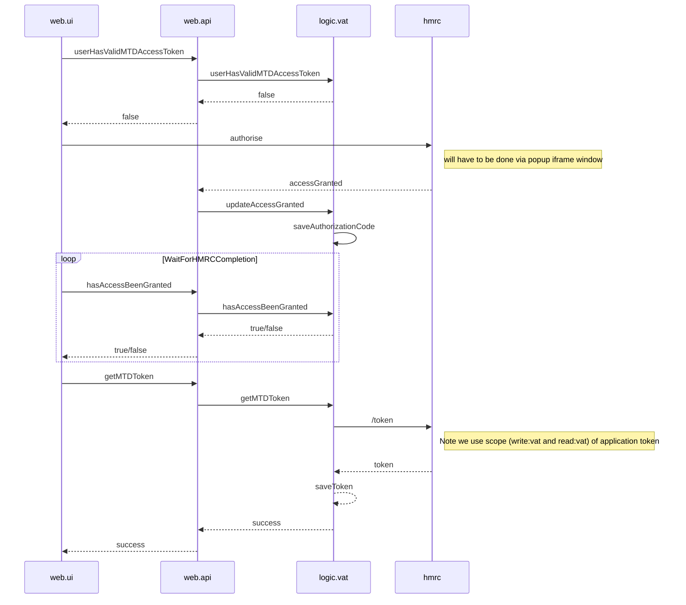
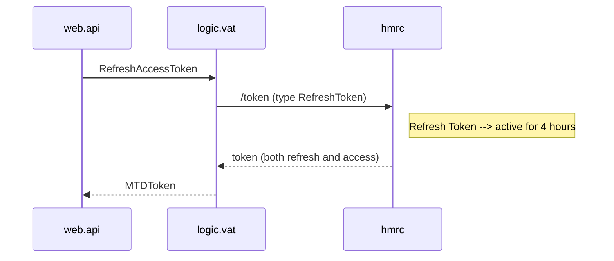
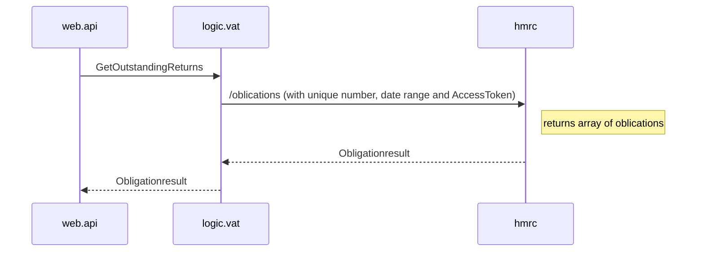
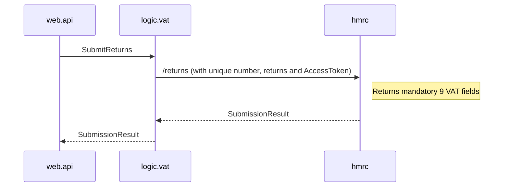
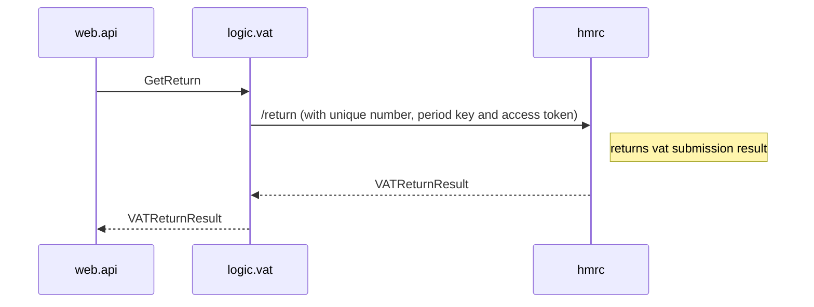

# HMRC VAT Flows

## GRANT Flow
Grant Cashplus access to the following:
* Submit VAT to HMRC
* Read VAT details from HMRC
* Save Application Code in database.
* Save AccessToken and RefreshToken in database
* Grant is valid for 18 months

## Access Token Refresh Flow
* Use refresh token to get new access token.
* After call both the access token and refresh token will be updated.
* Updated values (both access token and refresh token) will be saved in DB

## GET VAT Obligations Flow

    
## Submit VAT Return Flow

## Get VAT Return Flow

