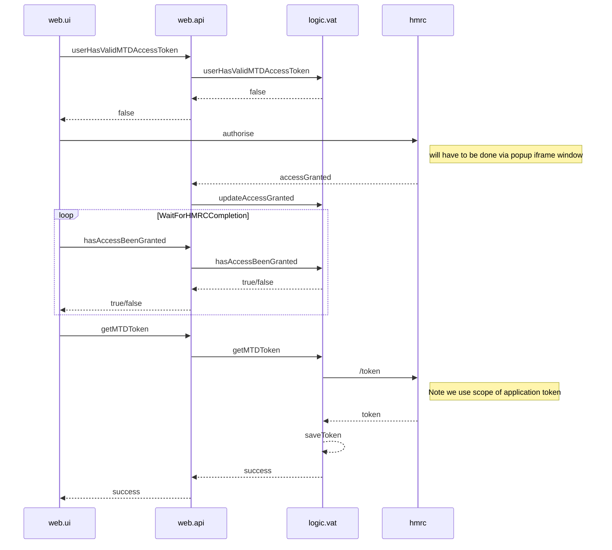

# TAX
TAX service

```mermaid


sequenceDiagram
    participant web.ui
    participant web.api
    participant logic.vat
    participant hmrc
    web.ui->>web.api:userHasValidMTDAccessToken
    web.api->>logic.vat: userHasValidMTDAccessToken
    logic.vat-->>web.api: false
    web.api-->>web.ui: false
    web.ui->>hmrc:authorise
    Note Right of hmrc: will have to be  done via popup iframe window
    hmrc-->>web.api:accessGranted
    web.api->>logic.vat : updateAccessGranted
    loop WaitForHMRCCompletion
      web.ui->>web.api : hasAccessBeenGranted
      web.api->>logic.vat : hasAccessBeenGranted
      logic.vat-->>web.api : true/false
      web.api-->>web.ui : true/false
    end 
    web.ui->>web.api:getMTDToken
    web.api->>logic.vat:getMTDToken
    logic.vat->>hmrc:/token
    Note Right of hmrc: Note we use scope of application token
    hmrc-->>logic.vat : token
    logic.vat-->>logic.vat : saveToken
    logic.vat-->>web.api : success
    web.api-->>web.ui : success

```
